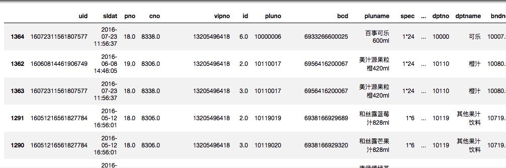
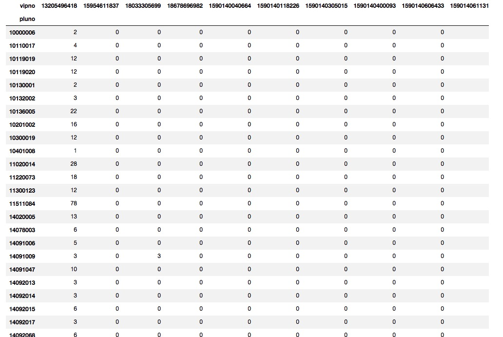
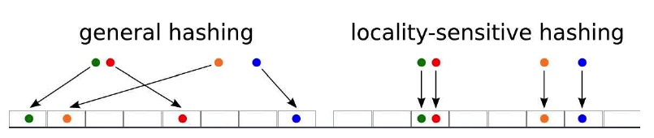
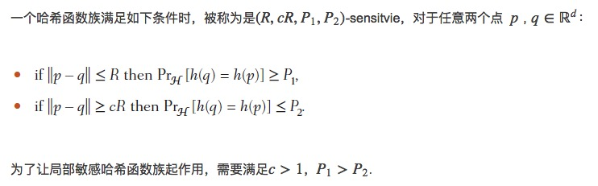
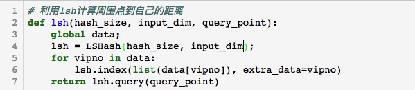
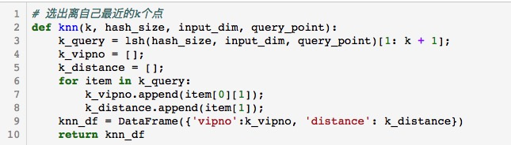
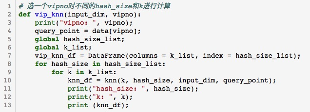
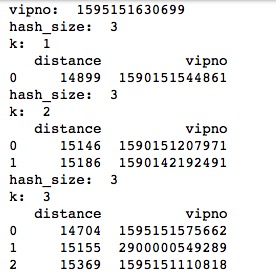
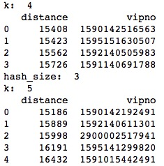
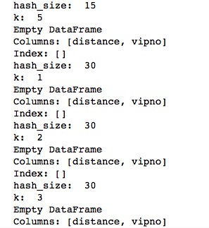

# Q1（数据预处理 + knn）

姓名：王依睿

学号：1552651

##  a) 获得矩阵

1. 使用``pandas.read_csv``读入数据

   

2.  将trade文件中的记录按照vipno分组，汇总每个vipno购买pluno的总记录数；将以上汇总的vipno分组转为一个矩阵，其中**矩阵行**代表为pluno，**矩阵列**代表为vipno，**矩阵元素**为该vipno所购买pbaoluno的总金额（取整，四舍五入），使用``DataFrame``格式存储

   

## b) knn

1. 安装并引入``lshash3``包

   lsh原理：

   

   

2. 将每条``vip``进行哈希操作并记录

3. 随机取一个点``vipno``

4. 利用``lsh``计算周围点到自己的距离

   

5. 选出离自己最近的k个点

   

6. 将每个矩阵列通过Pythong lshash进行索引处理，hash_size为全体vipno(非重复)总数的0.01, 0.05, 0.1, 0.2, 0.3, 0.5; 任意选择一个vipno, 然后输出该vipno对应knn的输出vipno (k = 1, 2, 3, 4, 5)

   

### 结果

	#### 讨论

当``hash_size``为全体vipno(非重复)总数的0.01时能求得随机点的临近点，其余情况由于``hash_size``太大使得点在哈希表上太过稀疏，从而无法求得临近点。

1. ​

