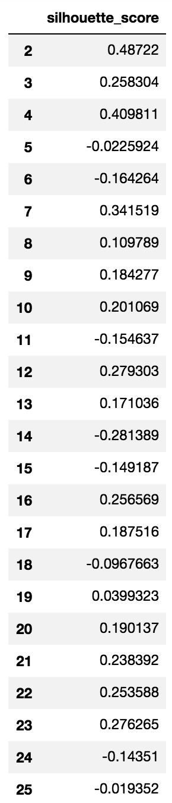
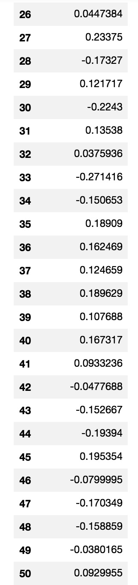
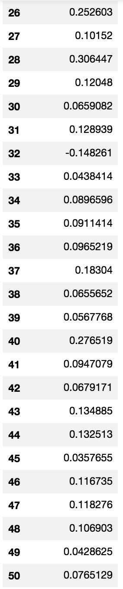
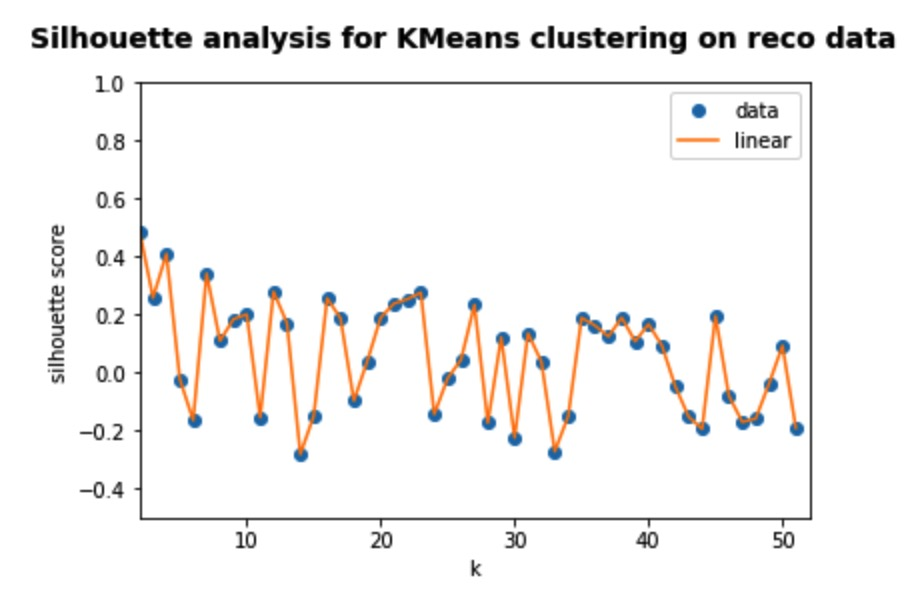
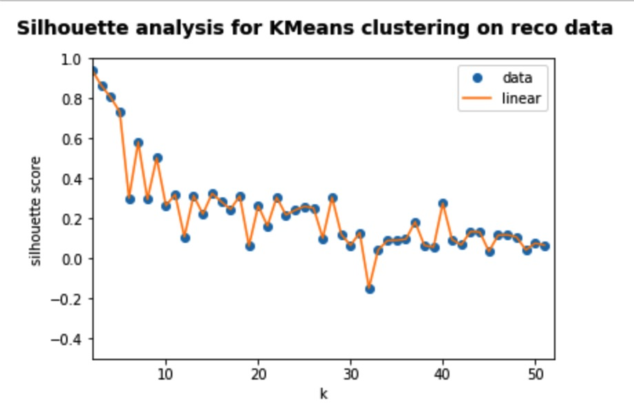
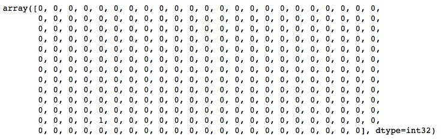
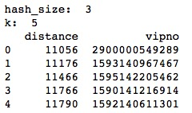

# Q2（k-means）

姓名：王依睿

学号：1552651

##  a) k-means

1. 引入``sklearn``和``KMeans``

   ```python
   import sklearn
   from sklearn.cluster import KMeans
   ```

2. k-means聚类并计算其silhouette系数

   ```python
   # k-means聚类并计算其silhouette系数
   def kmeans(n_clusters):
       X = StandardScaler().fit_transform(data.T)
       # Incorrect number of clusters
       labels = KMeans(n_clusters = n_clusters).fit_predict(X)
       silhouette_score = metrics.silhouette_score(X, labels, metric='euclidean')
       return silhouette_score
   ```

3. 选择不同的k进行k-means聚类并计算其silhouette系数

   ```Python
   # 选择不同的k进行k-means聚类并计算其silhouette系数
   def vip_kmeans():
       n_clusters_list = pd.Series(range(2, int(math.sqrt(vipno_total / 2) + 40)))
       vip_kmeans_df = pd.DataFrame(columns=['silhouette_score'], index = n_clusters_list)
       for n_clusters in n_clusters_list:
           silhouette_score = kmeans(n_clusters)
           vip_kmeans_df['silhouette_score'][n_clusters] = silhouette_score
       return vip_kmeans_df
   ```

### 结果

#### 	标准化后





#### 标准化前




1. 利用``matplotlib.pyplot``以k值为横轴、Silhouette系数值为y轴，画出Silhouette系数值-k值的函数图

   ```Python
   # 作图
   def kmeans_plot(vip_kmeans_df):
       f = interp1d(vip_kmeans_df.index, vip_kmeans_df.silhouette_score)
       xnew = vip_kmeans_df.index.copy()
       plt.plot(vip_kmeans_df.index, vip_kmeans_df.silhouette_score, 'o', xnew, f(xnew), '-')
       plt.xlim([2, int(math.sqrt(vipno_total / 2) + 40)])
       plt.ylim([-0.5, 1])
       plt.legend(['data', 'linear'], loc='best')
       plt.xlabel('k')
       plt.ylabel('silhouette score')
       plt.suptitle(
           "Silhouette analysis for KMeans clustering on reco data",
           fontsize=14, fontweight='bold')
       plt.show()
   ```

   #### 标准化后

   

   #### 标准化前

   

## b) 验证lsh的knn结果

1. 选择聚类效果较好的 k = 2 ，3，4时，查看聚类结果

   ```python
   X = StandardScaler().fit_transform(data.T)
   kmeans_labels = KMeans(n_clusters = 2).fit_predict(X)
   kmeans_labels
   ```

   

   

   

2. 查看knn结果

   

### 结论

1. 若将Silhouette系数作为评价k-means聚类质量的标准，则k-means算法倾向于将数据点聚类成较少的类别。
2. 根据聚类结果来看，k-means聚类倾向于将极大多数点分为一簇，其现实意义可能是由于大多数人的购物习惯都较为相似，数据量较少也是其中一个原因。
3. 正因为极大多数点划分为同一簇，从而使得验证lsh的knn结果时，lsh的knn查询结果与输入vipno都在同一个簇。