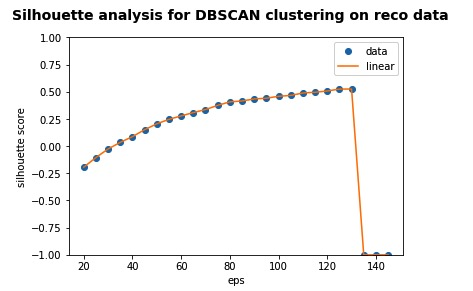
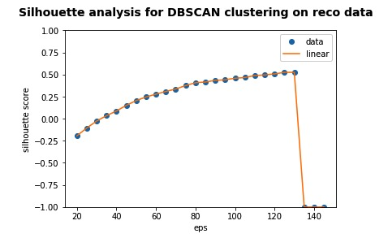
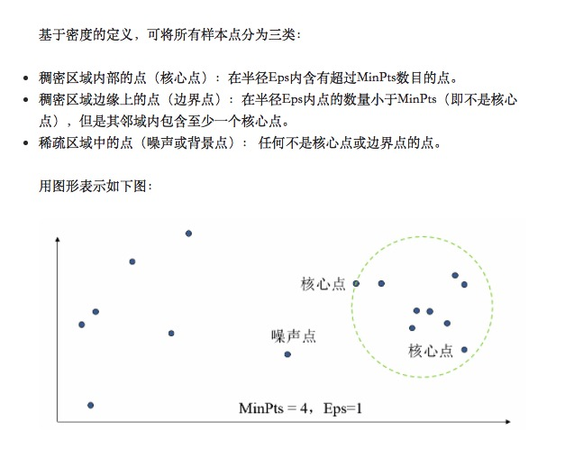

# Q3（DBSCAN）

姓名：王依睿

学号：1552651

##  a) DBSCAN

1. 引入``sklearn``和``DBSCAN``

   ```python
   import sklearn
   from sklearn.cluster import DBSCAN
   ```

2. DBSCAN聚类并计算其silhouette系数

   ```python
   # DBSCAN聚类
   def dbscan(eps):
       X = StandardScaler().fit_transform(data.T)
       db = DBSCAN(eps = eps).fit(X)
       labels = db.labels_
       if judge(labels):
           silhouette_score = metrics.silhouette_score(X, labels)
           return silhouette_score
       else:
           return -1
   ```

3. 选择不同的eps进行DBSCAN聚类并计算其silhouette系数

   ```Python
   # 选择不同的eps聚类并计算其silhouette系数
   def vip_dbscan():
       vip_dbscan_df = pd.DataFrame(columns = ['silhouette_score'], index = np.arange(20, 150, 5))
       for eps in np.arange(20, 150, 5):
           silhouette_score = dbscan(eps)
           vip_dbscan_df['silhouette_score'][eps] = silhouette_score
       return vip_dbscan_df
   ```

### 结果




2. 在小范围内查看silhouette score以选出最佳

   ```Python
   def detail_vip_dbscan():
       vip_dbscan_df = pd.DataFrame(columns = ['silhouette_score'], index = np.arange(125, 132, 1))
       for eps in np.arange(125, 132, 1):
           silhouette_score = dbscan(eps)
           vip_dbscan_df['silhouette_score'][eps] = silhouette_score
       return vip_dbscan_df
   # 在小范围内查看silhouette score以选出最佳的
   detail_vip_dbscan_df = detail_vip_dbscan()
   ```

   ### 结果

   

   当eps在125到130之间时，Silhouette系数稳定在0.524478，且当eps大于130时，只能得到1类。

## b) 验证lsh的knn结果

1. 选择聚类效果较好的 eps = 130时，查看聚类结果

   ```python
   # 选择聚类效果最好的 eps = 130 时，查看聚类结果
   X = StandardScaler().fit_transform(data.T)
   db = DBSCAN(130).fit(X)
   dbscan_labels = db.labels_
   ```

   

2. 查看knn结果

   

### 讨论

1. 查看多个聚类结果，发现DBSCAN将数据点分为两类，其中一类是值为-1的异常点
2. 若将Silhouette系数作为评价DBSCAN聚类质量的标准，则DBSCAN聚类倾向于将极大多数点分为一簇（非异常点），其现实意义可能是由于大多数人的购物习惯都较为相似，数据量较少也是其中一个原因。
3. 随着eps的增大，异常点类中的数目减小，Silhouette系数随之增大，knn查询结果与输入vipno所在同一个簇的概率也随之增大。
4. 当eps = 125～130时Silhouette系数取到最大点，聚类结果显示只有一个点被标记为异常点。

## c）比较DBScan和kmeans最优聚类

1. 聚类结果



	1. 从Silhouette系数来看，当k-means算法k取2时，取到最大值，为0.48722（标准化后）；当DBSCAN算法eps取130时，取到最大值，为0.524478（标准化后）。两者Silhouette系数相差不大，DBSCAN稍高一些。

2. k-means算法和DBSCAN算法都倾向于将数据点分为两类，并将极大多数点分为一类
3. k-means需要人为输入要聚的类数k，而DBSCAN可以发现任意形状的数据集且不用输入类别数K
4. DBSCAN可区分核心对象、边界点和噪音点，因此对噪声的过滤效果好

## DBSCAN原理



