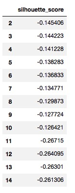
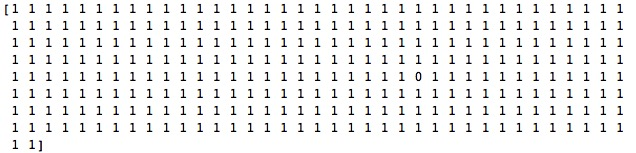

# Q4（GMM）

姓名：王依睿

学号：1552651

##   GMM

1. 引入``sklearn``和``DBSCAN``

   ```python
   import sklearn
   from sklearn.mixture import GaussianMixture
   ```

2. GMM聚类并计算其silhouette系数

   ```python
   # 使用gmm进行聚类
   def gmm(n_components):
       X = StandardScaler().fit_transform(data.T)
       gmm = GaussianMixture(n_components = n_components, covariance_type = 'full', max_iter=20, random_state=0)
       gmm.fit(X)
       labels = gmm.predict(X)
       silhouette_score = metrics.silhouette_score(X, labels)
       return silhouette_score
   ```

3. 选择不同的n_components进行GMM聚类并计算其silhouette系数

   ```Python
   # 选择不同的n_components聚类并计算其silhouette系数
   def vip_gmm():
       vip_gmm_df = pd.DataFrame(columns = ['silhouette_score'], index = np.arange(2, 15))
       for n_components in np.arange(2, 15):
           silhouette_score = gmm(n_components)
           vip_gmm_df['silhouette_score'][n_components] = silhouette_score
       return vip_gmm_df
   ```

### 结果




## a) 假定以Kmeans作为真实的聚类结果

1. ​

1. 选择Kmeans的最优聚类为2

2. 查看Kmeans和GMM的聚类结果

   ```python
   def gmm_kmeans(n_clusters):
       X = StandardScaler().fit_transform(data.T)
       kmeans_labels = KMeans(n_clusters = n_clusters).fit_predict(X)
       gmm = GaussianMixture(n_components = n_clusters, covariance_type = 'full', max_iter=20, random_state=0)
       gmm.fit(X)
       gmm_labels = gmm.predict(X)  
       print(kmeans_labels)
       print(gmm_labels)
   ```

### 结果


2. 计算GMM的准确率(accuracy)

```Python
cnt = 0
    for i, gmm_label in enumerate(gmm_labels):
        if gmm_label != kmeans_labels[i]:
            cnt += 1
    print("The accuracy for KMeans = ", cnt / float(len(gmm_labels)))
```

### 结果


## b）比较DBScan和kmeans最优聚类

1. 选择DBScan的最优聚类为2

2. 查看DBScan和GMM的聚类结果

   ```python
   def dbscan_kmeans(n_clusters):
       X = StandardScaler().fit_transform(data.T)
       db = DBSCAN(eps = 130).fit(X)
       dbscan_labels = db.labels_
       gmm = GaussianMixture(n_components = n_clusters, covariance_type = 'full', max_iter=20, random_state=0)
       gmm.fit(X)
       gmm_labels = gmm.predict(X)  
       print(dbscan_labels)
       print(gmm_labels)
   ```

### 结果


2. 计算GMM的准确率(accuracy)

### 结果


## c) 验证lsh的knn查询结果

1. 查看GMM的聚类结果

   

2. 查看knn的聚类结果

   

3. knn查询结果与输入vipno在同一个簇

## 讨论

1. 若将Silhouette系数作为评价GMM聚类质量的标准，Silhouette系数都比较低
2. 当聚类数目相等时，假定以Kmeans和DBScan作为真实的聚类结果，GMM的准确率都达到了99%以上，表明聚类结果非常相似。但当查看各种聚类算法结果时，都是极大多数点在同一类，只有1个点在另一类
3. 这次数据的特性使得通过聚类结果较难比较四种聚类算法的特性和优劣

## GMM原理

